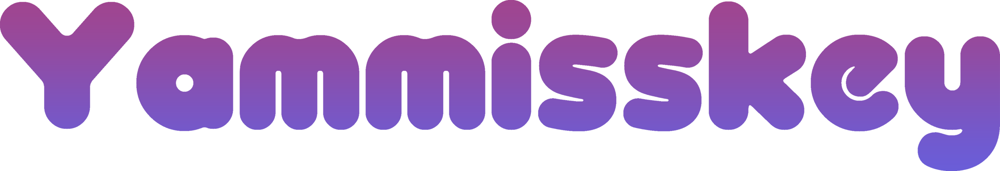

## SVG

<table>
<tr>
<td style="border-style:none;"></td>
</tr>
</table>
  
## PNG

<table>
<tr>
<td style="border-style:none;"></td>
</tr>
</table>
  
# yammiskey-svg

出来る限り元のMisskeyロゴに近づけるように作成。  
フォントは`OTADESIGN Rounded`

## 設定
元のMisskeyの`svg`ファイルからアニメーションや出来る限り大きな変更はせずに作成。  
Photoshopで作成したパスに合わせる為、細かいパラメータは変更している。  
```
   version="1.1"
   viewBox="-7 -15 280 70"
   height="205.08"
   width="680"
```
後述する`transform=`の値を変更するならば、上記で表示領域を変更する必要あり。  
変更してみて要調整。  

```css
  <style>
    #g8 {
      animation-name: floating;
      animation-duration: 3s;
      animation-iteration-count: infinite;
      animation-timing-function: ease-in-out;
    }

    @keyframes floating {
      0% { transform: translate(0, 0px); }
      50% { transform: translate(0, -8px); }
      100% { transform: translate(0, 0px); }
    }
  </style>
```
`animation-duration`の値を変更すれば動く時間は変更出来る。  
`50% { transform: translate(0, -8px); }`の`px`の値を変更することで可動域は変わる。  
元のパラメータは`5px`だが、元パスのサイズが大きい為値を調整。  
アニメーションを削除した画像ファイルのみにしたい場合上記のCSSアニメーションを削除することで可能。  
    
```
  <linearGradient id="myGradient" gradientTransform="rotate(90)">
    <stop offset="5%" stop-color="#A0458F" />
    <stop offset="95%" stop-color="#6A5DD8" />
  </linearGradient>
```
カラーコード指定で色を変更。  
指定なしだとブラック。  
```
    <path
      id="yamisskey"
      d="*省略*"
      transform="scale(0.3)"
      style="fill:url(#myGradient);"/>
```
`transform=`でサイズ調整。
